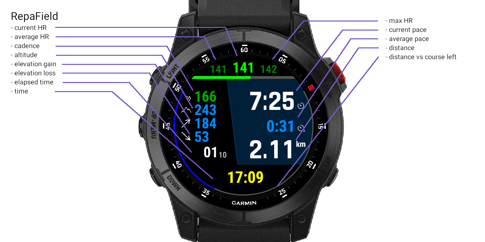

# garmin-repafield
Trail running focused Garmin watch DataField (for myself)

# Data shown

- heart rate
  - average
  - current
  - max
  - histogram
- pace (or speed)
  - current
  - average
- distance
- elevation
  - current
  - gain
  - loss
- configurable top left field
  - cadence
  - grade
  - gap
  - vertical speed
- distance to destination gauge
- next navigation point - on newer devices w/ higher resolution
  - distance
  - name

# Settings

- 3 theme colors
  - set primary theme color to 0 to use the HR color instead
- HR display type (value, percentage, zone)
- Top left field:
  - cadence
  - grade
  - GAP
  - vertical speed
- Display speed instead of pace
- Show next navigation point

